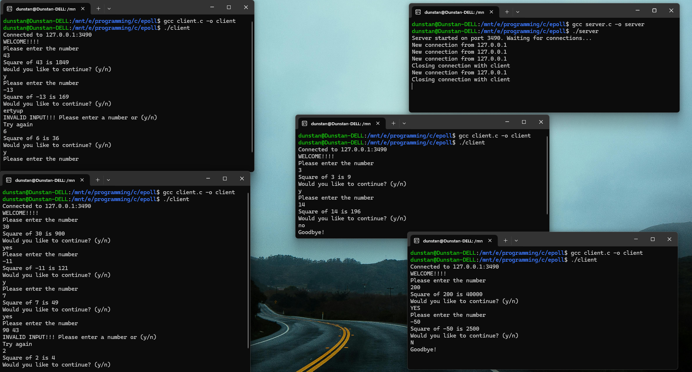

# Epoll-Based Client-Server System in C

## 📝 Description

This is a Linux-based client-server application written in C that demonstrates **non-blocking I/O multiplexing** using the `epoll` system call.

The server listens for multiple clients concurrently using `epoll` in **edge-triggered mode**, handles each request non-blockingly, and sends back the **square** of the number received from the client. It then asks if the client would like to continue or exit.

This project is ideal for understanding `epoll`, socket programming, and event-driven I/O on Linux.

---

## 🔧 Requirements

- GCC Compiler
- Linux system **or** Windows with WSL (Windows Subsystem for Linux)

---

## 🖥️ Compatibility

This project uses `epoll`, a Linux-specific system call.

> ✅ **Windows users can run this project using [WSL](https://learn.microsoft.com/en-us/windows/wsl/install)**  
> WSL allows you to run a full Linux environment inside Windows. Recommended distro: **Ubuntu**

**Steps for Windows Users:**
1. Install WSL using the guide linked above.
2. Open the WSL terminal.
3. Clone this repository or move the code files.
4. Compile and run the programs as you would on Linux.

---

## 🚀 Features

- 📌 Epoll-based, non-blocking, event-driven server using edge-triggered mode
- 📌 Cleanly handles multiple client connections
- 📌 Sends squared result back to client with a loop prompt
- 📌 Gracefully closes connections when client exits
- 📌 Robust handling of input, including invalid entries

---

## 🧑‍💻 Compilation

Use the following commands to compile:

```bash
gcc server.c -o server
gcc client.c -o client
```

---

## ▶️ Usage

### Compile

```bash
gcc server.c -o server
gcc client.c -o client
```

### Run

Open two terminals:

**Terminal 1 – Run the Server**

```bash
./server
```

**Terminal 2 – Run the Client**

```bash
./client
```

---

## 📂 File Structure

```
.
├── client.c      # Client-side implementation using sockets
├── server.c      # Epoll-based server handling multiple connections
├── output.png    # Screenshot of terminal output
└── README.md     # Project documentation
```

---

## 🧭 Workflow

```text
Client                             Server
  |                                   |
  | --- connect() ------------------>|
  |                                   |
  |<-- Welcome message & prompt -----|
  |                                   |
  |--- Send number ----------------->|
  |                                   |
  |<-- Send square result -----------|
  |                                   |
  |--- Send (y/n) to continue ------>|
  |                                   |
  |<-- Loop prompt or Goodbye -------|
  |                                   |
```

---

## 🧠 Concepts Demonstrated

- Socket API: `getaddrinfo()`, `socket()`, `bind()`, `listen()`, `accept()`
- Multiplexing with `epoll_create1()`, `epoll_ctl()`, and `epoll_wait()`
- Edge-triggered event handling via `EPOLLET`
- Non-blocking I/O with `fcntl()`

---

## 🖼️ Screenshots



---

## 📚 References

- [Beej's Guide to Network Programming](https://beej.us/guide/bgnet/)
- [Linux epoll man page](https://man7.org/linux/man-pages/man7/epoll.7.html)
- *The Linux Programming Interface* by Michael Kerrisk

---

## 🏁 License

This project is licensed under the [MIT License](https://opensource.org/licenses/MIT).


